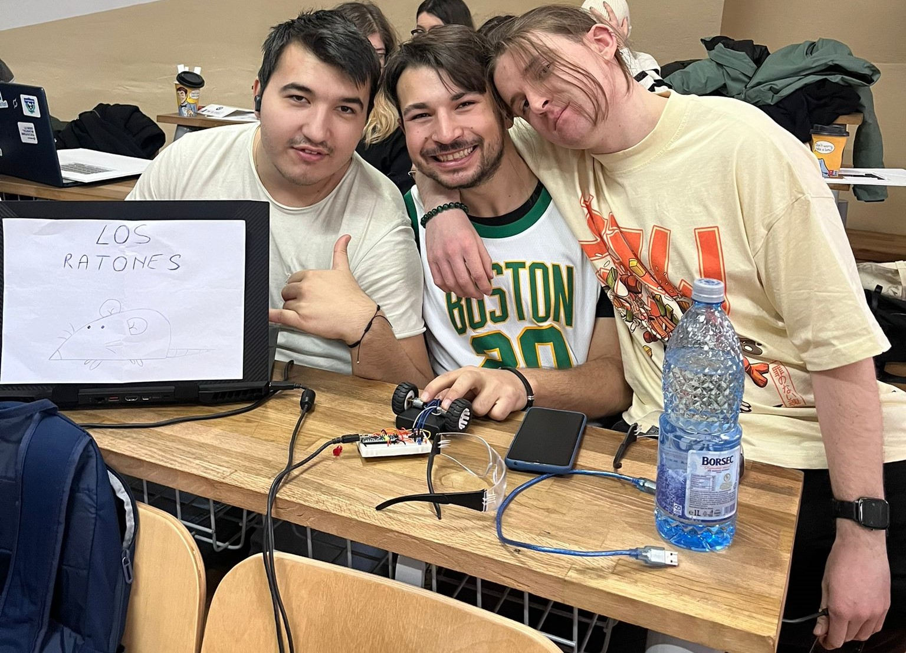

# LRTV

LRTV is an MVC-based web application inspired by HLTV.org, the established site for Counter-Strike esports.

## Features

- **Home Page**: A chic homepage that provides a some of the latest news, the best performing player right now, top teams, and recent matches.
- **Player Profiles**: Dedicated player pages showcasing individual statistics.
- **Team Rankings**: A page dedicated to the highest-ranked teams, and for each team a dedicated page that show some info about them and their player lineups.
- **Match Coverage**: Information on the latest matches, including match details, maps played, and team lineups.
- **News and Comments**: Latest news articles with a commenting system allowing logged-in users to leave their opinions on the news.
- **Photos** : Our photos are saved in a cloud system.
- **User Roles**:
  - **Not Logged Users**: Can view all content but cannot leave comments.
  - **Logged-In Users**: Can view all content and leave comments on news articles.
  - **Moderators**: Have permissions to edit news articles, team information, and other site content.
  - **Administrators**: Have full control over the site, including user management and content moderation.

## Technologies Used

- **ASP.NET MVC**: The core framework for building the web application.
- **Entity Framework**: For database interactions and ORM.
- **SQL Server**: The database engine for storing site data.
- **Bootstrap**: For a nice touch on the aspect of the site.

## Acknowledgements

LRTV is inspired by [HLTV.org](https://www.hltv.org/), the leading source for Counter-Strike esports coverage.

### 8. The LRTV team 

### 🐭[Beselinho](https://github.com/Beselinho) 🎯[GeorgePopescu318](https://github.com/GeorgePopescu318) 👺[Vapus](https://github.com/Vapuss)

  